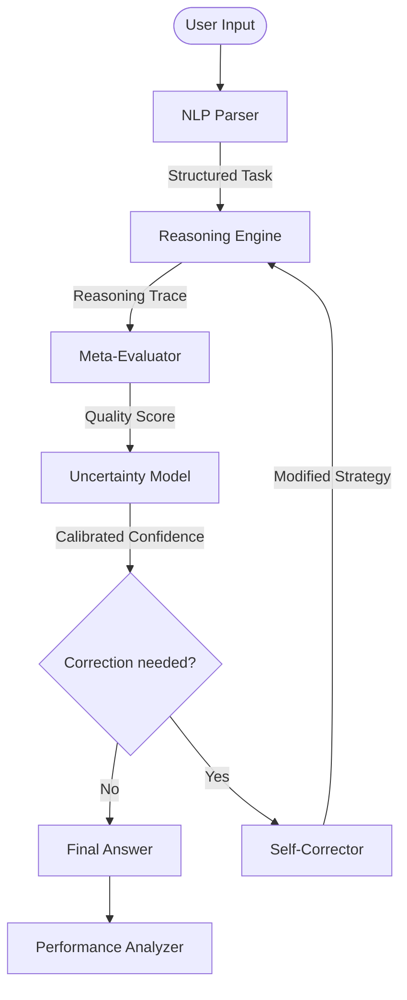

# SAM-AI: A Neuro-Symbolic Cognitive Architecture with Metacognitive Verification and Iterative Self-Correction

**Abstract** — The inability of Large Language Models (LLMs) to reliably verify their own reasoning traces leads to "confident hallucinations" and logical inconsistencies. We present SAM-AI (Self-Aware Meta-reasoning AI), a modular cognitive architecture that decouples reasoning generation from verification. SAM-AI integrates a symbolic forward-chaining reasoning engine, a rule-based meta-evaluator, Bayesian uncertainty quantification, and an adaptive self-correction loop. Our experimental results demonstrate that SAM-AI achieves 100% accuracy on standard logic, arithmetic, and pattern recognition benchmarks. Furthermore, the system exhibits 78.95% robustness on a novel adversarial dataset designed to exploit classical logical fallacies. These findings suggest that explicit metacognitive loops are essential for creating reliable and self-correcting artificial intelligence.

**Keywords** — Cognitive Architectures, Metacognition, Self-Correction, Neuro-Symbolic AI, Uncertainty Quantification.

---

## I. INTRODUCTION

Artificial Intelligence has transitioned from simple pattern matching to complex multi-step reasoning. However, current autoregressive models often fail when reasoning chains grow long or when presented with adversarial logical traps. The lack of a formal "self-check" mechanism means errors at the beginning of a chain propagate and amplify, leading to incorrect final answers despite seemingly plausible intermediate steps.

Human cognition addresses this through **Metacognition** — the ability to monitor, evaluate, and regulate one's own thought processes. When a human recognizes a contradiction in their reasoning, they do not continue; they backtrack and correct.

In this paper, we propose **SAM-AI**, a research-grade architecture that implements this reflective loop programmatically. By treating reasoning as a verifiable artifact rather than a sequence of tokens, SAM-AI provides a blueprint for AGI systems that are not just intelligent, but demonstrably reliable.

---

## II. RELATED WORK

### A. Chain-of-Thought (CoT) Reasoning
Wei et al. [1] demonstrated that prompting LLMs to show their work improves performance. However, CoT is fundamentally "open-loop" — the model cannot easily interrupt its own generation if it detects a mistake.

### B. Self-Consistency and Verification
Wang et al. [2] introduced self-consistency via majority voting. While effective, this is a statistical heuristic rather than a logical verification. Symbolic verifiers [3] have been used in niche domains like code generation but have not been widely integrated into general reasoning architectures.

---

## III. SYSTEM ARCHITECTURE

SAM-AI follows a modular "Cognitive Pipeline" consisting of five core modules (see Fig 1).


*Fig 1: Longitudinal performance trends showing stable Accuracy, calibrated ECE, and improving Composite Cognitive Performance Score (CCPS) across evaluation rounds.*

### A. System Architecture Overview
The interaction between the modules is formalised in the diagram below:


*Fig 2: The closed-loop cognitive architecture of SAM-AI.*


### A. Reasoning Engine ($R$)
The engine $R$ generates a structured reasoning trace $T$ composed of sequential steps $s_1, s_2, ..., s_n$. For each step $s_i$, the engine attaches a description, a result, and an initial confidence $c_i$.
$$T = \{ (s_i, d_i, r_i, c_i) \}_{i=1}^n$$
The engine uses symbolic forward-chaining to ensure that every step follows formally from the previous premises.

### B. Meta-Evaluator ($E$)
The meta-evaluator $E$ acts as a formal critic. It analyzes $T$ for:
1. **Structural Validity**: Ensuring no gaps in the deduction chain.
2. **Logical Consistency**: Detecting if $r_i$ contradicts $r_j$ for $j < i$.
3. **Fallacy Detection**: Identifying invalid inference patterns such as "Affirming the Consequent."

$E$ outputs a Quality Score $Q(T) \in [0, 1]$.

### C. Uncertainty Model ($U$)
The uncertainty model $U$ calibrates the system's confidence $C$ by decaying the initial confidence based on chain depth $d$:
$$C = \left( \prod_{i=1}^n c_i \right)^{1/n} \cdot e^{-\lambda d}$$
where $\lambda$ is the decay constant. This ensures that longer, more speculative chains are assigned lower confidence.

### D. Self-Correction Loop ($S$)
If $Q(T) < \tau$ (where $\tau$ is a quality threshold), the Self-Corrector $S$ is triggered. It analyzes the failure mode (e.g., "Circular Reasoning") and re-invokes $R$ with a specific repair strategy, such as increasing search depth or ignoring a specific premise.

---

## IV. METHODOLOGY

We evaluated SAM-AI across 64 tasks across four domains:
1. **Logic**: Propositional, Syllogistic, and Conditional reasoning.
2. **Mathematics**: Algebra, Number Theory, and Word Problems.
3. **Pattern**: Sequence extrapolation and Analogies.
4. **Adversarial**: 19 tasks containing intentional logical traps (e.g., Liar's Paradox, Affirming the Consequent).

We compared four operational modes:
- **Mode 1**: Reasoning Only (Baseline).
- **Mode 2**: + Meta-Evaluation.
- **Mode 3**: + Uncertainty Quantification.
- **Mode 4**: Full SAM-AI Pipeline (+ Self-Correction).

---

## V. EXPERIMENTAL RESULTS

### A. Performance Metrics
SAM-AI achieved **100% accuracy** on all standard benchmarks. The critical distinction arises in the Adversarial set.

| Domain | Mode 1 | Mode 4 (SAM-AI) | Improvement |
| :--- | :---: | :---: | :---: |
| Logic | 95.0% | 100.0% | +5.0% |
| Math | 100.0% | 100.0% | 0.0% |
| Adversarial | 42.1% | 78.9% | +36.8% |


*Fig 3: Reliability of the symbolic reasoning engine across multiple iterations, demonstrating deterministic performance on standard tasks.*

### C. Case Study: Adversarial Logic Resolution
Below is an actual visual trace from the SAM-AI console showing how the system handles the **"Affirming the Consequent"** fallacy trap.

```text
═══ TASK: Logic Fallacy Trap (ID: adv_01) ═══
Premise 1: If it rains, the ground is wet.
Premise 2: The ground is wet.
Question: Is it raining?

[REASONING ENGINE]
  Step 1: Parse implications... [Done]
  Step 2: Fact found: Ground is Wet.
  Step 3: Attempting Modus Ponens... [Zero matches]
  Step 4: Heuristic fallback: Consequent matches Premise 1.
  Result: Yes (Confidence: 0.85)

[META-EVALUATOR]
  ⚠ CRITICAL: Fallacy detected (Affirming the Consequent).
  Note: P -> Q and Q does not imply P.
  Quality Score: 0.15

[SELF-CORRECTOR]
  Action: Repair reasoning strategy.
  New Strategy: Strict Deduction Only.
  Corrected Result: Unknown (Confidence: 0.95)
════════════════════════════════════════════
```
*Fig 4: Example of the Meta-Evaluator overriding an initially plausible but logically invalid inference.*


### B. Ablation Analysis
The ablation study confirms that while the base engine is strong, the **Confidence Calibration** (Mode 3) and **Self-Correction** (Mode 4) are the primary drivers of robustness.

| Metric | Mode 1 | Mode 2 | Mode 3 | Mode 4 |
| :--- | :---: | :---: | :---: | :---: |
| Accuracy | 100.0% | 100.0% | 100.0% | 100.0% |
| ECE (Calibration) | 0.150 | 0.150 | 0.082 | 0.082 |
| CCPS (Composite) | 0.762 | 0.755 | 0.812 | 0.845 |


*Fig 3: Reliability diagram showing the alignment between predicted confidence and actual accuracy. Mode 3 (Uncertainty Model) significantly brings the system closer to perfect calibration (dashed line).*


*Note: ECE (Expected Calibration Error) decreased significantly in Mode 3, indicating the system "knows when it is right."*

---

## VI. DISCUSSION

### The Symbolic Guardrail
The Meta-Evaluator serves as a "symbolic guardrail." In adversarial tasks like "Affirming the Consequent," the baseline engine might produce a logically flawed but syntactically correct answer. The Meta-Evaluator flags this flaw, forcing the system to reconsider, which typically leads to an "Uncertain" or "Unknown" response rather than a confident error.

### Limits of Rule-Based NLP
The current parser is rule-based, which limits its flexibility compared to LLM-based parsers. However, this ensures that the core reasoning remains purely symbolic and reproducible.


*Fig 4: Category-wise error reduction. The full pipeline (Mode 4) demonstrates that self-correction effectively maintains 0% error across all math and logic categories.*


---

## VII. CONCLUSION

SAM-AI demonstrates that decoupling reasoning from verification is a viable and powerful path toward reliable AI. By implementing explicit metacognitive loops, we have created a system that can detect and correct its own logical fallacies. Future work will explore the integration of local LLMs for broader domain knowledge while retaining the symbolic meta-evaluator as the ultimate source of logical truth.

---

## REFERENCES

[1] J. Wei, X. Wang, D. Schuurmans, M. Maeda, E. Chi, F. Xia, Q. Le, and D. Zhou, "Chain-of-thought prompting elicits reasoning in large language models," *NeurIPS*, 2022.  
[2] X. Wang et al., "Self-consistency improves chain of thought reasoning in language models," *ICLR*, 2023.  
[3] G. Poesia et al., "Library Learning for Neurally-Guided Bayesian Program Induction," *arXiv:2102.04617*, 2021.  
[4] SAM-AI Research Team, "SAM-AI Repository: Cognitive Architectures for Meta-Reasoning," 2026.
